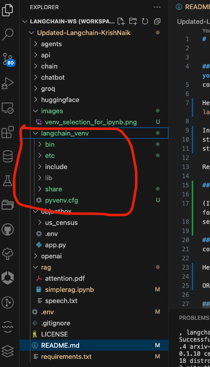
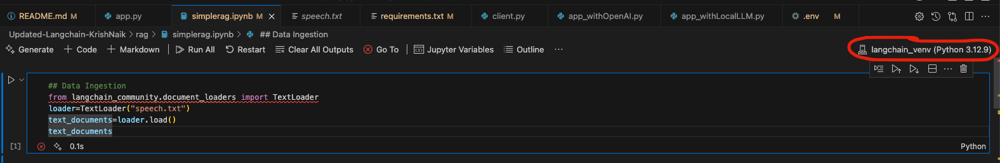

# Langchain Tutorials
###### Last Updated: 04-04-2025
###### Co-Author: Iman
___
#### Conda is installed, you can create environments, install packages, and manage your Python environments using Conda.
conda create --name myenv python=3.8

Here, I have created a virtual env named - langchainenv => `conda create --name langchainenv python=3.8`

In Mac, run following command after it - 
step 1 - `conda init zsh`
step 2 - `source ~/.zshrc`

Restart terminal.

###### ALTERNATIVELY

(If you want to use venv for creating virtual environment, you can use the following command => `python3 -m venv langchain_venv`
select that virtual envirnoment using => `source langchain_venv/bin/activate`)

#### Activate the environment:
conda activate myenv

Here, use => `conda activate langchainenv`

OR, => `source langchain_venv/bin/activate`

Once you create a venv for your VS code project, it should appears like below in your VS code:
{: width="250px" height="400px"}

#### Deactivate the environment:
=> `conda deactivate`

OR, => `deactivate`

### Install the required packages:
Use command => `pip install -r requirements.txt`

### Select virtual environment in .ipynb files:
Your venv should be activated before running the .ipynb files.
Then, select the virtual environment in the .ipynb file by clicking on the "Kernel" dropdown.
In this case , select "langchain_venv" (as your virtual environment).
